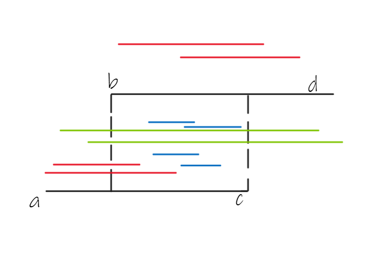

## Introducere

Să considerăm o dinamică cu următoarea formulă:

$$
dp(i,j) = \min_{0\leq k \leq j} ( dp(i-1, k-1) + C(k,j)),
$$

unde $C(i,j)$ este o funcție de cost care poate fi calculată în $O(1)$. De
asemenea, $dp(i,j) =0$ pentru $j<0$.

O implementare simplă ne-ar da o complexitate de $O(M \cdot N^2)$ dacă
$0 \leq i < M$ și $0\leq j < N$, deci se impune găsirea unei optimizări care să
îmbunătățească soluția.

În cele ce urmează, vom prezenta tehnica Divide & Conquer DP, care ne va permite
să optimizăm această dinamică la $O(M \cdot N \log N)$.

Mai întâi, vom defini pentru un $(i, j)$ oarecare $\text{opt}(i,j)$ ca fiind
valoarea care minimizează expresia din ecuație. Astfel, D&C DP se aplică doar
dacă $\text{opt}(i,j) \leq \text{opt}(i,j+1).$

De multe ori, demonstrația poate fi dificil de găsit, dar dacă funcția de cost
respectă [quadrangle inequality](https://codeforces.com/blog/entry/86306),
condiția se aplică.

!!! note "Observație"
    De multe ori, dacă credeți că problema pe care o rezolvați are o asemenea
    optimizare în spate, puteți începe prin a scrie o soluție brută, iar dacă
    $\text{opt}(i,j) \leq \text{opt}(i,j+1).$ se aplică, sunt șanse mari să
    puteți folosi această optimizare cu destul de mult succes.

Astfel, vom putea aplica ideea din spatele divide et impera. Pentru un interval
$(L, R)$, știm punctele posibile care pot fi optime $(opt_L, opt_R)$. Astfel,
vom încerca să calculăm dinamica pentru valoarea din mijloc, iar în funcție de
valoarea optimă găsită (o notăm $opt$), vom împărți intervalele recursiv
în două, după cum urmează:

- $(L, mid-1)$, respectiv $(opt_L, opt)$
- $(mid+1, R)$, respectiv $(opt, opt_R)$.

Vom continua acest lucru până când ajungem la intervale unitare, caz în care ne
vom opri.

Deoarece fiecare valoare a $\text{opt}(i, j)$ apare de $O(\log n)$ ori,
vom avea o complexitate finală de $O(mn \log n)$.

## Problema exemplu - [Subarray Squares CSES](https://cses.fi/problemset/task/2086/)

!!! note "Observație"
    Această problemă are și o soluție video postată de Algorithms Conquered
    [aici](https://www.youtube.com/watch?v=Ec3fSWk9JOw).

Pentru a rezolva această problemă, ne putem gândi mai întâi la o dinamică simplă
dar care este prea înceată, în stilul celei descrise mai devreme în articol.

Totuși, se poate observa că proprietatea legată de valorile optime pentru fiecare
stare se respectă, ceea ce ne duce cu gândul la aplicarea tehnicii D&C pentru
implementarea acestei probleme.

Recomandăm citirea implementării de mai jos, deoarece este una educațională și
instructivă și pentru celelalte probleme pe care le veți rezolva folosind
această tehnică.

```cpp
--8<-- "avansat/dc-dp/subarraysquares.cpp"
```

## Problema [RoAlgo Contest #7 suxumetre](https://kilonova.ro/problems/1906)

!!! note "Observație"
    Acest editorial a fost scris de [Matei Ionescu](https://rocphof.kilonova.ro/person/2375)
    și [Andrei Chertes](https://rocphof.kilonova.ro/person/102) ca parte a
    [RoAlgo Contest #7](https://kilonova.ro/contests/34)

Dinamicele de genul sunt foarte clasice, chiar au o optimizare foarte faină.
Pentru un dp cum ar fi $dp_{i, j} = min(dp_{i - 1, k} + C(k + 1, j)$, notăm
$opt(i, j)$ ca fiind "the optimum splitting point" și egal cu $k$-ul
care minimizează $dp_{i, j}$.

Atunci putem spune că $opt(i, j - 1) \leq opt(i, j)$ pentru oricare $(i, j)$
doar dacă oricum am alege patru indici $(a, b, c, d), C(a, b) + C(b, d) \leq C(a, d) + C(b, c)$;

$$C(x, y) = \sum_{x \leq i \leq j \leq y}{}sp(i, j) \text{, unde } sp(i, j) = \sum_{k = i}^{j}v_k\mod{m}$$

Conform definiției avem $sp(x, y) \geq 0$ și $C(x, y) \geq 0$.



În primul rând, vom analiza ce intervale contribuie la costurile din
inegalitatea de mai sus. Distingem trei tipuri de intervale:

- interval roșu: inclus în $[a, c]$ sau $[b, d]$, dar nu în $[b, c]$.
- interval albastru: inclus în $[b, c]$.
- interval verde: inclus în $[a, d]$, dar nu în $[a, c]$ sau $[b, d]$.

Vom scrie membrul stâng și membrul drept al inegalității în funcție de cele
trei tipuri de intervale:

- $C(a, c) + C(b, d) = \sum sp(interval_{roșu}) + 2 \sum sp(interval_{albastru})$
- $C(a, d) + C(b, c) = \sum sp(interval_{roșu}) + 2 \sum sp(interval_{albastru}) + \sum sp(interval_{verde})$
- $C(a, c) + C(b, d) \leq C(a, d) + C(b, c) \Leftrightarrow 0 \leq \sum sp(interval_{verde})$

ceea ce este adevărat din definiția funcției $sp(x, y)$.

Putem deci să dezvoltăm un algoritm tip "divide and conquer", unde vom împărți
succesiv vectorul în două intervale $[st, mij], [mij + 1, dr]$ și să calculăm
dinamica pentru $mij$ în intervalul $[opt(i, st), opt(i, dr)]$.

Complexitatea finală va fi astfel $O(k \cdot n \ log \ n)$.

```cpp
--8<-- "avansat/dc-dp/suxumetre.cpp"
```

## Concluzii

Această tehnică este una foarte des întâlnită în ceea ce privește optimizările
de programarea dinamică, fiind relativ ușor de înțeles după ce ați căpătat
suficientă experiență cu celelate tehnici specifice programării dinamice.

Recomandăm și abordarea problemelor de mai jos, precum și a articolelor suplimentare
care cuprind multe explicații la problemele suplimentare și nu numai.

## Probleme suplimentare

- [Infoarena cubeon](https://www.infoarena.ro/problema/cubeon)
- [ONI 2006 Petrom](https://kilonova.ro/problems/89/)
- [Codeforces Ciel and Gondolas](https://codeforces.com/contest/321/problem/E)
- [Atcoder Yakiniku Restaurants](https://atcoder.jp/contests/arc067/tasks/arc067_d)
- [Codeforces Yet Another Minimization Problem](https://codeforces.com/contest/868/problem/F)
- [USACO Platinum Circular Barn](https://usaco.org/index.php?page=viewproblem2&cpid=626)
- [USACO Platinum Mowing Mischief](https://usaco.org/index.php?page=viewproblem2&cpid=926)
- [COI 2015 Nafta](https://oj.uz/problem/view/COI15_nafta)
- [Codeforces Trucks and Cities](https://codeforces.com/contest/1101/problem/F)
- [JOI 2013 Bubblesort](https://atcoder.jp/contests/joi2013ho/tasks/joi2013ho5)
- [IOI 2014 Holiday](https://oj.uz/problem/view/IOI14_holiday)
- [Codeforces Partition Game](https://codeforces.com/contest/1527/problem/E)

## Resurse suplimentare

- [Divide and Conquer DP - USACO Guide](https://usaco.guide/plat/DC-DP?lang=cpp)
- [Dynamic Programming Optimizations - Codeforces](https://codeforces.com/blog/entry/8219)
- [Quadrangle Inequality Properties - codeforces](https://codeforces.com/blog/entry/86306)
- [DP Optimizations - HKOI](https://assets.hkoi.org/training2023/dp-iii.pdf)
- [Divide and Conquer DP - cp-algorithms](https://cp-algorithms.com/dynamic_programming/divide-and-conquer-dp.html)
- [Divide and Conquer DP - Jeffrey Xiao](https://jeffreyxiao.me/blog/divide-and-conquer-optimization)
- [DP optimization - Divide and Conquer Optimization - Robert1003](https://robert1003.github.io/2020/02/25/dp-opt-divide-and-conquer.html)
